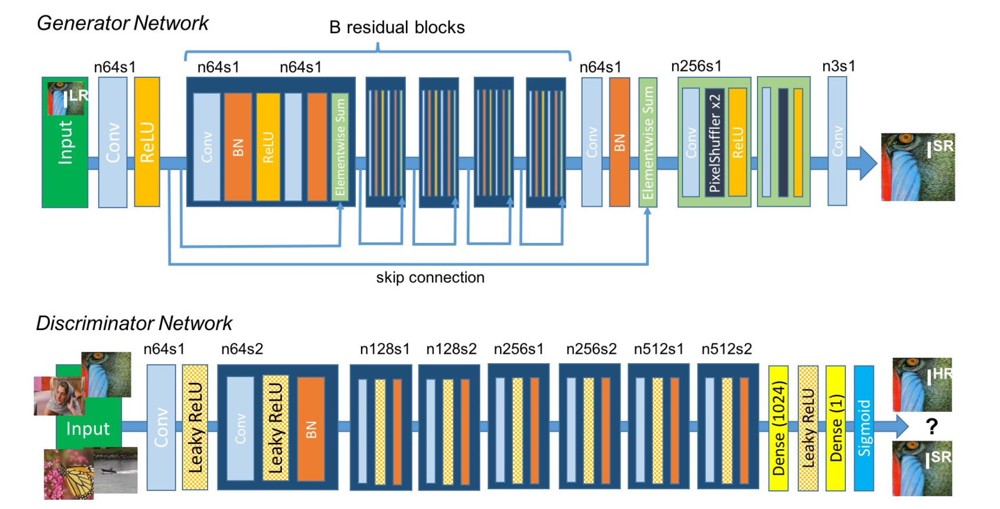
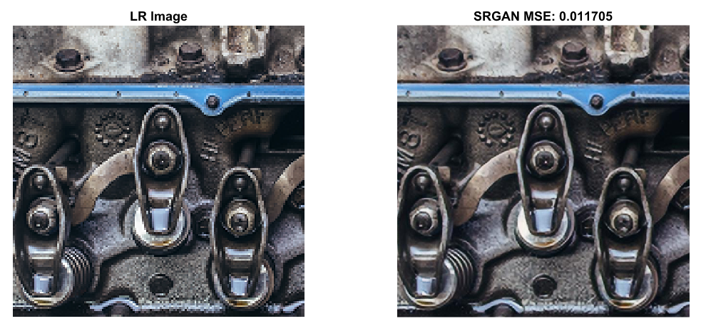
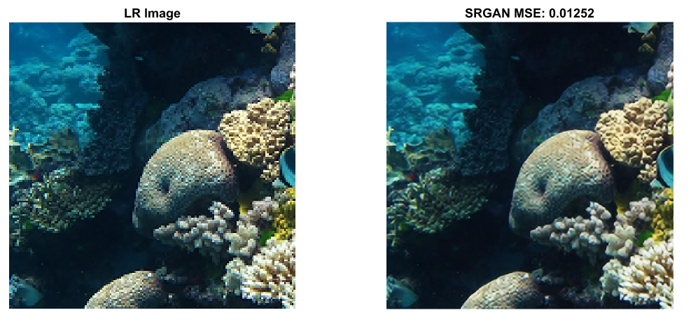

# Image-Super-Resolution-Using-GAN-SRGAN
This repo contains the project work carried out for the course Deep Learning in my B.Tech Final Year DA-IICT. It is the replication of the code in simpler terms available on GitHub. 

1. Reference Paper Link: [Photo-Realistic Single Image Super-Resolution Using a Generative Adversarial Network](https://arxiv.org/pdf/1609.04802.pdf)
2. Reference Code Link: [Github](https://github.com/leftthomas/SRGAN)

## Dataset
You need to have the high resolution images for training. In this project, we have used images from **DIV2K - bicubic downscaling x4 competition**, so the hyper-paremeters are (like number of epochs) are seleted basic on that dataset, if you change a larger dataset you can reduce the number of epochs. Following are some links to download training andd test dataset:
1. [Valid HR](https://data.vision.ee.ethz.ch/cvl/DIV2K/validation_release/DIV2K_valid_HR.zip)
2. [Train HR](https://data.vision.ee.ethz.ch/cvl/DIV2K/DIV2K_train_HR.zip)
3. [Valid LR](https://data.vision.ee.ethz.ch/cvl/DIV2K/DIV2K_valid_LR_bicubic_X4.zip)
4. [Train LR](https://data.vision.ee.ethz.ch/cvl/DIV2K/DIV2K_train_LR_bicubic_X4.zip)

## Model/ Architecture 


## Pre-Trained Model
We have trained our model upto 100 epochs. Weights can be found from the `Pre Trained Weights/` folder. You can fine tune the parameter and resume the training of the model. To load the model weights, follow the step shown below.
* Provide the path of your weights in the first cell variable `G_weights_load` and `G_weights_load`.  
* Uncomment 2 lines i.e line no 16 and 17 in the training cell.
	* ```netG.load_state_dict(torch.load(G_weights_load))```
	* ```netD.load_state_dict(torch.load(D_weights_load))```
  

## Run
* Open ipynb file in either google colab. 
* Put the notebook on GPU mode. 
* Change the path depending up on your file structure in the first cell.  
* Run all cells.

## Results
* Sample results are available in the `Results/sr/` folder.



## Other colloborators 
1. Ruchit Vithani
2. [Bhargey Mehta](https://github.com/bhargeymehta)
3. Kushal Shah
